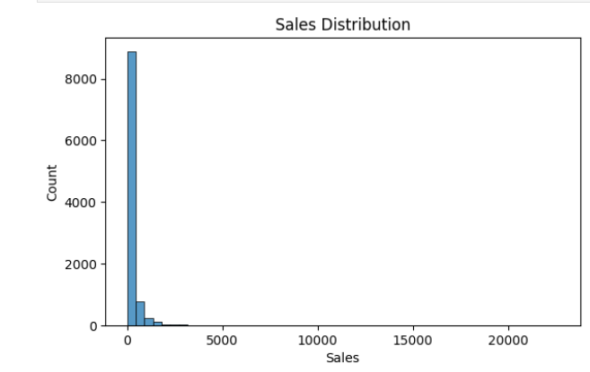
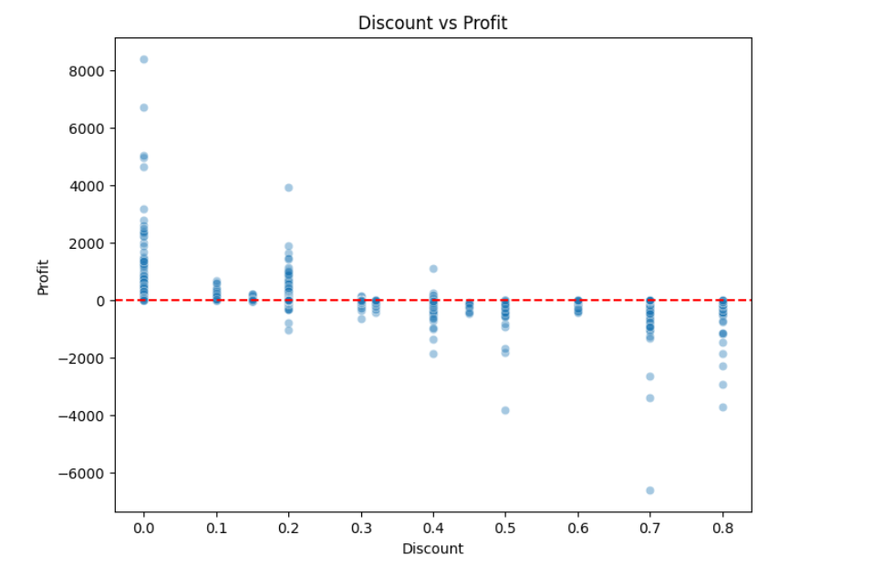
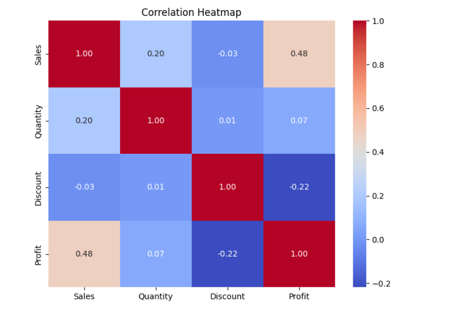

# ApexPlanet Data Analytics Internship

## Overview

This repository contains my work for the ApexPlanet Data Analytics Internship Program 2026. The internship focuses on developing practical skills in data analytics, including data cleaning, exploratory data analysis (EDA), SQL querying, database management, and extracting business insights from real-world datasets using Python and SQL.

The project uses the Sample Superstore dataset and demonstrates a complete analytics workflow, beginning with data preparation and exploratory analysis, followed by SQL-based data extraction, aggregation, and database integration.

---

# Task 1: Foundational Setup and Exploratory Data Analysis (EDA)

## Overview

This repository contains my work for Task 1 of the ApexPlanet Data Analytics Internship, covering environment setup, data sourcing, data cleaning, and exploratory data analysis (EDA) on a retail sales dataset. The goal of this task was to set up a proper analytics workflow and practice extracting insights from a real-world-style dataset using Python.

## Dataset

For this project, I used the Sample Superstore dataset from Tableau's sample datasets. It contains 10,194 transactional records from a retail superstore, with 21 columns covering order details, customer information, product categories, sales, discounts, and profit. I picked this dataset because it has a good mix of numerical and categorical variables, which made it well suited for the kind of EDA this task asked for.

---

## Repository Structure

```text
apexplanet-data-analytics/
├── data/
│   ├── raw/                  # Original, unmodified dataset
│   └── processed/            # Cleaned dataset after preprocessing
├── notebooks/
│   ├── EDA_Task1.ipynb       # Task 1: Exploratory Data Analysis
│   └── SQL_Task2.ipynb       # Task 2: SQL and Data Extraction
├── scripts/
│   ├── db_utils.py           # Database utility functions
│   └── queries.sql           # Collection of SQL queries
├── reports/
│   └── images/               # Visualisations used in README
├── dashboards/                # Power BI / Tableau dashboards
├── superstore.db              # SQLite database
├── requirements.txt
└── README.md
```

---

## Tools and Libraries

### Programming and Analysis

* Python 3.10
* pandas
* numpy

### Data Visualisation

* matplotlib
* seaborn

### Database Technologies

* SQLite
* SQLAlchemy

### Development Environment

* Jupyter Notebook
* VS Code

---

## What This Task Covers

### Environment Setup

Installed the required Python libraries and organised the project into a structured folder hierarchy for data, notebooks, reports, and dashboards.

### Data Sourcing and Understanding

Loaded the dataset into a pandas DataFrame and reviewed its structure (shape, columns, data types) before doing anything else, along with documenting the data source, collection method, and limitations.

### Data Cleaning

Checked for missing values and duplicate rows (none found in either case), converted the relevant columns to category type, and used the IQR method to identify outliers in Sales and Profit. The outliers were kept rather than removed, since they reflect genuine business events such as bulk orders and heavy discounting rather than data entry errors. The full cleaning steps are documented in the notebook, along with a cleaning log.

### Exploratory Data Analysis

Generated statistical summaries and value counts, ran univariate analysis (histograms, boxplots, bar charts), and bivariate analysis (a discount vs profit scatter plot and a correlation heatmap) to look for patterns and relationships in the data.

---

## Key Findings

* Discounting has a clear negative effect on profit. Orders with discounts above 0.5 are mostly loss-making, and Discount and Profit show a negative correlation of -0.22.
* Sales is driven by a relatively small number of large orders. Most transactions are under 1,000, but a long tail of bigger orders pulls the distribution out to over 20,000.
* Office Supplies and the Consumer segment account for the highest order volumes, but a high order count does not necessarily mean higher profitability per order.
* Outliers in Sales and Profit (around 11.6% and 18.8% of the data, respectively) appear to reflect real business activity rather than data quality issues, so they were retained for the analysis.

---

## Sample Visualisations

### Sales Distribution



### Discount vs Profit



### Correlation Heatmap



---

## How to Run (Task 1)

1. Clone this repository.
2. Install the required libraries:

```bash
pip install pandas numpy matplotlib seaborn
```

3. Open `notebooks/EDA_Task1.ipynb` in Jupyter Notebook or VS Code.
4. Run the cells in sequence.

---

# Task 2: SQL and Data Extraction

## Overview

Task 2 focused on developing practical SQL skills for data extraction, transformation, and analysis. Building on the cleaned dataset prepared in Task 1, the data was imported into a SQLite database and queried using SQL. The objective was to understand how databases store information, retrieve meaningful records efficiently, and generate business insights through structured queries.

This task also demonstrated how SQL can be integrated with Python to automate analysis workflows and manage data programmatically.

---

## Database Setup

The cleaned Superstore dataset was loaded into a SQLite database (`superstore.db`) using Python. SQLite was selected because it is lightweight, easy to configure, and ideal for learning relational database concepts without requiring a separate database server.

The database served as the central source for executing SQL queries and performing data extraction tasks.

---

## What This Task Covers

### SQL Fundamentals

Implemented and practised a wide range of SQL concepts, including:

* SELECT statements
* WHERE filtering conditions
* ORDER BY sorting
* LIMIT clause
* Aggregate functions:

  * COUNT()
  * SUM()
  * AVG()
  * MIN()
  * MAX()
* GROUP BY
* HAVING
* Subqueries
* Common Table Expressions (CTEs)

These queries were used to summarise data, identify trends, and answer business-related questions.

### Joins

Created and analysed relationships between tables using:

* INNER JOIN
* LEFT JOIN
* RIGHT JOIN (implemented through SQLite-compatible alternatives)
* FULL OUTER JOIN (implemented through SQLite workarounds)

A category sales target reference table was used to demonstrate how relational databases combine information from multiple sources.

### Business-Oriented SQL Analysis

Several practical business questions were answered using SQL, including:

* Monthly sales performance analysis
* Top 10 customers by revenue
* Product category performance
* Sales and profit comparison across categories
* Customer retention analysis

Each query was accompanied by a brief interpretation to explain the business significance of the results.

### Advanced SQL Techniques

Applied advanced analytical SQL functions such as:

* ROW_NUMBER()
* RANK()
* LAG()
* LEAD()
* Cumulative sums (running totals)
* Moving averages

These techniques demonstrated how SQL can be used for trend analysis and performance tracking.

### Views and Query Optimisation

Created reusable database objects and explored performance optimisation techniques through:

* SQL Views
* Query execution plans
* EXPLAIN QUERY PLAN
* Database indexing

These concepts improved query readability, reusability, and efficiency.

### Python and SQL Integration

Connected Python with SQLite using:

* sqlite3
* SQLAlchemy

Executed SQL queries directly from Python, stored results in pandas DataFrames, and used parameterised queries to improve security and prevent SQL injection vulnerabilities.

---

## SQL Deliverables

The task includes the following deliverables:

### SQL Notebook

`notebooks/SQL_Task2.ipynb`

Contains:

* Database creation
* Data loading
* SQL queries
* Query outputs
* Business observations
* Python-SQL integration examples

### SQL Query File

`scripts/queries.sql`

Contains all SQL statements used throughout the project for easy reference and reuse.

### Database Utility Module

`scripts/db_utils.py`

Contains reusable functions for:

* Creating database connections
* Executing SQL queries
* Loading query results into pandas DataFrames

---

## Task 2 Learning Outcomes

Through this task, I gained hands-on experience in:

* Relational database concepts
* Writing efficient SQL queries
* Data extraction and transformation
* Database connectivity using Python
* Analytical SQL functions
* Query optimisation techniques
* Converting raw database records into actionable business insights

---

## How to Run (Task 2)

1. Clone this repository.
2. Install all required dependencies:

```bash
pip install -r requirements.txt
```

3. Open `notebooks/SQL_Task2.ipynb` in Jupyter Notebook or VS Code.
4. Run the notebook cells sequentially.
5. The notebook automatically creates and populates `superstore.db` using the cleaned dataset from Task 1.

---

# Internship Outcomes

Across Task 1 and Task 2, this project demonstrates a complete foundational data analytics workflow:

* Data sourcing and understanding
* Data cleaning and preprocessing
* Exploratory data analysis
* Statistical summarisation
* SQL-based data extraction
* Database management
* Business insight generation
* Python-SQL integration

The work reflects the practical application of analytics concepts commonly used in industry for transforming raw data into meaningful and actionable information.

---

## Author

**Khushi Vig**

B.Tech, Electronics and Communication Engineering
Guru Tegh Bahadur Institute of Technology (GTBIT)
Guru Gobind Singh Indraprastha University (GGSIPU)

ApexPlanet Data Analytics Internship Program 2026