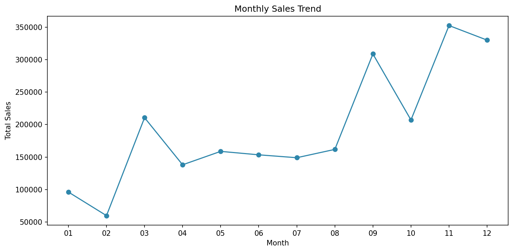
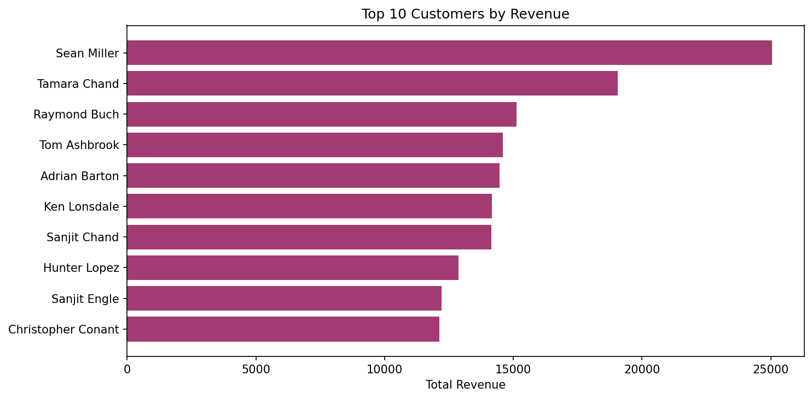
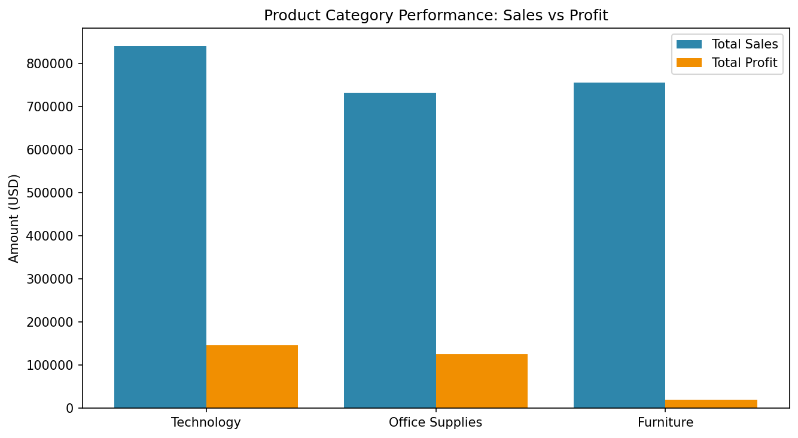
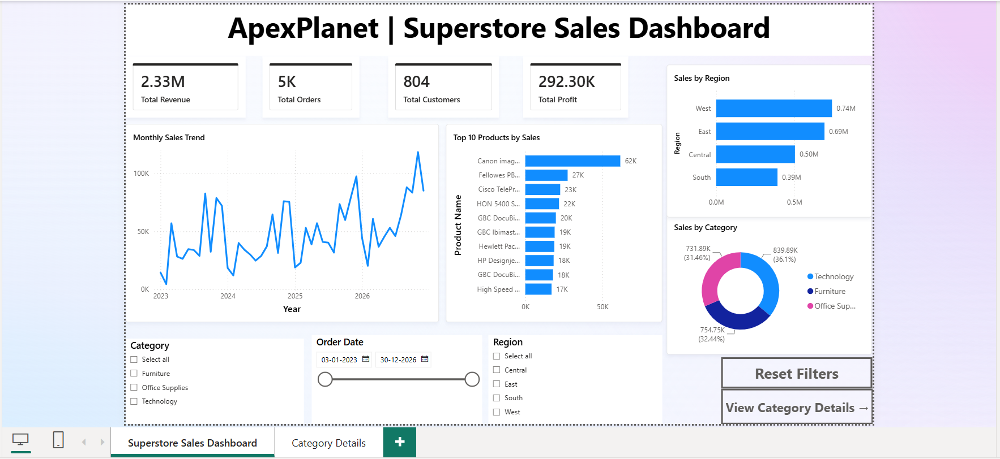
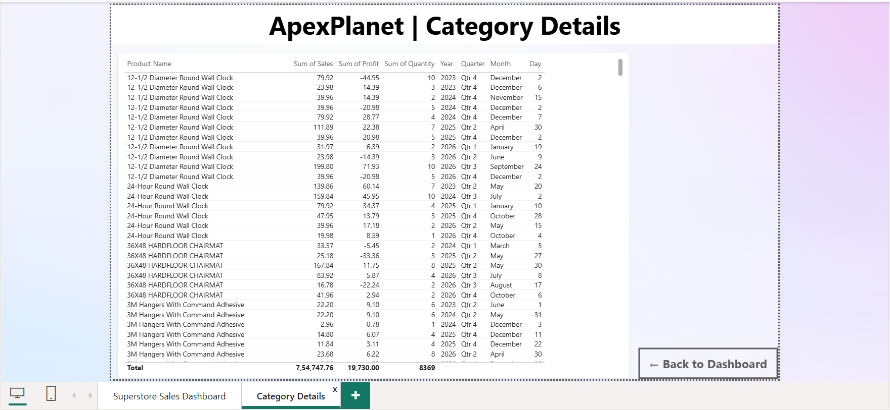

# ApexPlanet Data Analytics Internship 2026

**Organisation:** ApexPlanet Software Pvt. Ltd.
**Programme:** Data Analytics Internship 2026
**Submitted by:** Khushi Vig

## Overview

This repository contains my work for the ApexPlanet Data Analytics Internship, built around the Sample Superstore dataset. This repository currently covers the first three: Task 1 (environment setup, data cleaning, and exploratory data analysis), Task 2 (SQL extraction and Python-database integration), and Task 3 (Python visualization and an interactive Power BI dashboard). 
## Dataset

Sample Superstore dataset (Tableau sample data), 10,194 transactional records across 21 columns covering order details, customer information, product categories, sales, discounts, and profit. This dataset was chosen for its mix of numerical and categorical variables, which made it well suited to exploratory analysis, SQL practice, and visualization work across all three tasks.

## Repository Structure

```
apexplanet-data-analytics/
├── data/
│   ├── raw/                                 # Original, unmodified dataset
│   └── processed/
│       └── cleaned_superstore.csv           # Cleaned dataset used across all tasks
├── notebooks/
│   ├── EDA_Task1.ipynb                      # Task 1: cleaning and exploratory analysis
│   ├── SQL_Task2.ipynb                      # Task 2: SQL queries and Python integration
│   └── Task3_Visualization.ipynb            # Task 3: Matplotlib, Seaborn, Plotly visualizations
├── scripts/
│   ├── db_utils.py                          # Reusable database connection module (Task 2)
│   └── queries.sql                          # Standalone SQL file, 22 queries (Task 2)
├── reports/
│   └── images/                              # Chart and dashboard images referenced in this README
├── outputs/
│   └── charts/                              # Task 3 static PNG chart exports
├── dashboards/
│   ├── monthly_sales_trend.html             # Task 3: interactive Plotly export
│   ├── sales_by_category_region.html        # Task 3: interactive Plotly export
│   ├── sales_trend_by_category_dropdown.html
│   ├── sales_vs_profit_scatter.html
│   └── superstore_executive_dashboard.pbix  # Task 3: Power BI executive dashboard
├── superstore.db                            # SQLite database (generated on first run of Task 2, excluded from version control)
├── .gitignore
├── requirements.txt
└── README.md
```

## Tools and Technologies

| Category | Tool |
|---|---|
| Language | Python 3.10 |
| Data Manipulation | pandas, numpy |
| Static Visualization | Matplotlib, Seaborn |
| Interactive Visualization | Plotly |
| Database | SQLite via `sqlite3`, SQLAlchemy |
| BI Dashboarding | Power BI Desktop |
| Development Environment | Jupyter Notebook, VS Code |

---

## Task 1: Foundational Setup & Exploratory Data Analysis

**Notebook:** `notebooks/EDA_Task1.ipynb`

Set up the analytics environment and project folder structure for the whole internship, then performed a full cleaning and exploratory analysis pass on the raw Superstore dataset.

**What it covers:**

- Environment setup and installation of the required Python libraries
- Data sourcing and structure review (shape, columns, data types), along with documentation of the data source, collection method, and known limitations
- Data cleaning: checked for missing values and duplicate rows (none found in either case), converted the relevant columns to `category` type, and used the IQR method to identify outliers in Sales and Profit
- A full cleaning log documenting every transformation applied
- Univariate analysis (histograms, boxplots, bar charts) and bivariate analysis (a discount vs profit scatter plot and a correlation heatmap) to surface patterns and relationships in the data

**Key findings:**

- Discounting has a clear negative effect on profit. Orders with discounts above 0.5 are mostly loss-making, and Discount and Profit show a negative correlation of -0.22
- Sales is driven by a relatively small number of large orders. Most transactions are under 1,000, but a long tail of bigger orders pulls the distribution out past 20,000
- Office Supplies and the Consumer segment account for the highest order volumes, but a high order count does not necessarily mean higher profitability per order
- Outliers in Sales and Profit (around 11.6% and 18.8% of the data, respectively) appear to reflect real business activity, such as bulk orders and heavy discounting, rather than data quality issues, so they were retained for the analysis

**Sample visualizations:**


---

## Task 2: SQL & Data Extraction

**Notebook:** `notebooks/SQL_Task2.ipynb`
**Supporting files:** `scripts/queries.sql`, `scripts/db_utils.py`

Loaded the cleaned Task 1 dataset into a local SQLite database and wrote 22 numbered queries spanning basic retrieval through advanced window functions, then connected Python directly to the database for an integrated analysis workflow.

**Database setup:** The cleaned Superstore dataset was loaded into a local SQLite database (`superstore.db`) using `pandas.DataFrame.to_sql()`. SQLite was chosen because it is lightweight, file-based, and requires no separate server installation, a practical and portable choice for a project focused on learning SQL syntax and relational database concepts rather than managing infrastructure. A second table, `category_targets`, was created manually to hold a fictional set of sales targets for three product categories, including one category not present in the main sales data. This deliberate mismatch means all four join types produce meaningfully different results when demonstrated side by side.

**What it covers:**

*SQL Fundamentals*
- Basic retrieval and filtering with `SELECT`, `WHERE`, `ORDER BY`, and `LIMIT`
- All five core aggregate functions (`COUNT`, `SUM`, `AVG`, `MIN`, `MAX`)
- Grouping with `GROUP BY` and filtering grouped results with `HAVING`
- A correlated subquery rewritten as a Common Table Expression using the `WITH` clause, to show how CTEs improve readability
- Window functions: `ROW_NUMBER()` and `RANK()` with `PARTITION BY` and `ORDER BY`, plus `LAG()` and `LEAD()` for comparing each row against its neighbours

*Joins and Advanced SQL*
- All four join types (`INNER`, `LEFT`, `RIGHT`, `FULL OUTER`) between the main sales table and `category_targets`, with SQLite-specific workarounds implemented for `RIGHT` and `FULL OUTER`, since SQLite does not support them natively
- Monthly sales trends extracted using `substr()` on the stored date string
- Top 10 customers by revenue, identified with `GROUP BY`, `ORDER BY DESC`, and `LIMIT 10`
- Product category performance, aggregating both sales and profit and sorting by profit to show that the highest-selling category is not always the most profitable
- Customer retention rate, calculated two ways: a `HAVING` query listing customers with more than five orders, and a CTE with a `CASE` expression producing a single retention percentage
- Moving averages using `AVG() OVER (ROWS BETWEEN 6 PRECEDING AND CURRENT ROW)` and cumulative sums using `SUM() OVER (ORDER BY date)`
- A saved SQL view, `CategorySummary`, storing the category-level aggregation as a reusable named object
- Query optimization: `EXPLAIN QUERY PLAN` run before and after adding an index on `Customer Name`, showing the execution plan change from a full table scan to an indexed search

*Python and SQL Integration*
- Two connection methods: Python's built-in `sqlite3` module for direct connections, and a SQLAlchemy engine for a database-agnostic connection that would work identically with PostgreSQL or MySQL
- Every query executed through `pandas.read_sql()`, loading results directly into DataFrames for further analysis
- A parameterized customer lookup query using a `?` placeholder, preventing SQL injection by keeping the query structure and user-supplied value separate
- A reusable `db_utils.py` module wrapping all connection logic into importable functions: `get_connection()`, `get_engine()`, `run_query()`, and `load_dataframe_to_table()`

**Key findings:**

- Revenue is concentrated in a small group of top customers, which would justify dedicated account management or loyalty investment
- Technology leads on both sales and profit, meaning it leads on margin quality as well as volume. Office Supplies generates the highest order count but a comparatively lower profit contribution
- Customer retention is high. The large majority of customers who placed at least one order went on to place another, indicating healthy repeat purchasing behaviour
- A 7-period moving average makes the underlying monthly sales trend substantially easier to read than the raw monthly figures, which are obscured by individual large orders in certain months

**Sample visualizations:**





---

## Task 3: Data Visualization & Dashboarding

**Notebook:** `notebooks/Task3_Visualization.ipynb`
**Dashboards:** `dashboards/` (4 interactive HTML exports plus a Power BI `.pbix` file)

Built 13 visualizations across Matplotlib, Seaborn, and Plotly on the same cleaned dataset, then built a full interactive executive dashboard in Power BI Desktop.

**What it covers:**

*Python Visualization*
- Matplotlib: a monthly sales line plot, a category bar chart, a sales distribution histogram, a sales-vs-profit scatter plot, and a 2x2 business overview subplot grid combining category, region, segment, and ship mode comparisons
- Seaborn: a correlation heatmap across Sales, Profit, Quantity, and Discount, a pairplot split by category, a boxen plot of sales distribution by category, and a FacetGrid showing the monthly sales trend separately for each region
- Plotly: an interactive grouped bar chart for sales by category and region, a line chart with a draggable range slider for the monthly trend, a dropdown-filtered line chart to switch between category trends, and an interactive sales-vs-profit scatter plot with hover details, all exported as standalone HTML files for sharing without needing Python installed

*Power BI Setup and Basics*
- Connected Power BI Desktop to the cleaned CSV and verified date columns were correctly typed
- Created four DAX measures: Total Revenue, Total Orders, Total Customers, and Total Profit

*Advanced Dashboarding*
- Built an executive dashboard with the following visuals: four KPI cards (revenue, orders, customers, profit), a chronological monthly sales trend line (Year and Month together, not collapsed into a repeating 12-month cycle), a category breakdown donut chart, a sales-by-region bar chart (used in place of a geographic map, since the Region field could not be reliably geocoded), and a top 10 products by sales bar chart
- Added a full filter panel with slicers for Category, Region, and an Order Date range
- Built a drill-through detail page (Category Details) showing product-level data, accessible by right-clicking any category slice on the main dashboard
- Added page navigation buttons (View Category Details, Back to Dashboard) and a genuine Power BI bookmark (Reset Filters) that snaps all slicers back to their default state, wired through the button's Action settings rather than page navigation
- Applied consistent branding through a title header and background colour theme

*Optimization and Documentation*
- Verified all charts and KPI cards respond correctly to slicer and bookmark interactions
- Documented the dashboard structure and files in this README

**Key findings:**

- Sales follow a strong seasonal pattern, spiking sharply every November and December and dropping to their lowest point right after, in January and February. Despite month-to-month volatility, the year-end peaks themselves trend upward over time, pointing to solid year-over-year growth
- Discounting is the primary driver of losses across every chart that touches it. The heatmap (-0.22 correlation), the static scatter plot, and the interactive scatter all agree that heavily discounted orders frequently fall below break-even, regardless of order size
- Technology drives the most revenue but is also the most volatile category, with a small number of large orders making up a disproportionate share of its total
- The West region shows strong overall sales, though the single highest category-region combination is actually Furniture in the West, and within Technology specifically, the East region leads rather than West, showing that regional strength varies by category rather than one region dominating everywhere

**Dashboard screenshots:**




---

## How to Run

**Step 1:** Clone this repository

```bash
git clone https://github.com/KhushiVig/apexplanet-data-analytics.git
cd apexplanet-data-analytics
```

**Step 2:** Install the required libraries

```bash
pip install -r requirements.txt
```

**Step 3:** Confirm the cleaned dataset is present at `data/processed/cleaned_superstore.csv`

**Step 4:** Run the notebooks in order from `notebooks/`

- `EDA_Task1.ipynb` first, for data cleaning and exploration
- `SQL_Task2.ipynb` next, this creates `superstore.db` automatically on first run
- `Task3_Visualization.ipynb` last, this generates the 9 chart PNGs in `outputs/charts/` and the 4 dashboard HTML files in `dashboards/`

**Step 5:** Open `dashboards/superstore_executive_dashboard.pbix` in Power BI Desktop to explore the interactive dashboard

---

## Learning Outcomes

Across these three tasks, I gained hands-on experience in:

- Setting up a structured analytics project and virtual environment
- Cleaning and exploring real-world tabular data, including justified decisions on outlier handling
- Writing SQL from basic retrieval through joins, subqueries, CTEs, and window functions
- Connecting Python to a relational database using both `sqlite3` and SQLAlchemy, and writing parameterized queries to prevent SQL injection
- Building a reusable database utility module
- Creating static and interactive visualizations across three different Python libraries
- Designing and building a full interactive Power BI dashboard, including DAX measures, slicers, drill-through pages, and bookmarks
- Documenting a multi-stage project clearly enough for someone else to clone and run it end to end

## Author

**Khushi Vig**
-ApexPlanet Data Analytics Internship Programme 2026